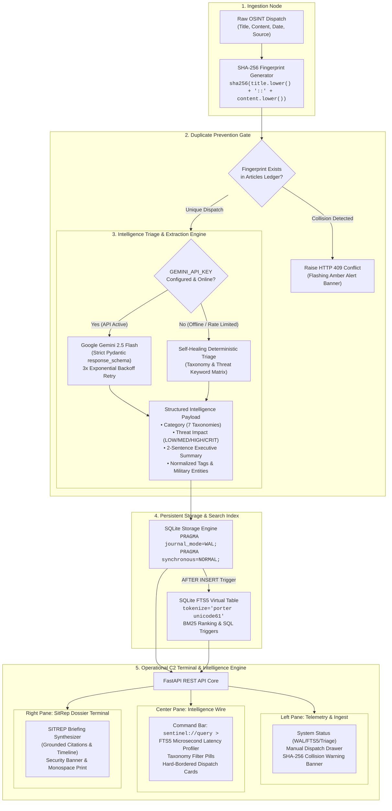

# ASTRA SENTINEL — TACTICAL DEFENCE OSINT & THREAT MONITORING TERMINAL

[](https://www.python.org/)
[](https://fastapi.tiangolo.com)
[](https://sqlite.org)
[](https://ai.google.dev)
[]()

> **ASTRA 3-Day Build Challenge — Operational Deliverable**  
> An authentic, production-grade Open-Source Defence Intelligence (OSINT) Terminal and Situation Report (SITREP) synthesis engine built with FastAPI, SQLite WAL/FTS5, and Google Gemini 2.5 Flash.

---

## 1. Tactical Architecture

The following diagram illustrates the unidirectional dataflow and defensive gating implemented across ASTRA Sentinel:



---

## 2. Key Capabilities & Architectural Invariants

* **Anti-Fatigue Tactical C2 Terminal Interface:**  
  Strictly avoids generic AI SaaS styling, bubbly cards, and floating glassmorphic templates. Employs high-contrast dark mode (`#080b0f`, `#0f141c`), sharp borders, `JetBrains Mono` / `IBM Plex Mono` typography, tracked uppercase labels, and phosphor emerald/amber/crimson accents.
* **Deterministic Deduplication (SHA-256):**  
  Every dispatch undergoes lowercase normalized SHA-256 fingerprinting `(title + "::" + content)`. Duplicate submissions trigger an immediate `HTTP 409 Conflict` and activate an amber collision banner detailing the collided hash and existing document ID.
* **SQLite WAL & FTS5 Synchronization:**  
  Operates on SQLite configured with `PRAGMA journal_mode=WAL;` and `PRAGMA synchronous=NORMAL;` for high-throughput concurrent reads and writes. A virtual FTS5 table with Porter stemmer tokenization is updated via native database triggers.
* **Hybrid Search Engine:**  
  Supports real-time full-text search with BM25 ranking (`MATCH ? ORDER BY rank`). Automatically falls back to SQL `LIKE` wildcard search if invalid FTS syntax is provided, profiling execution latency down to milliseconds.
* **Gemini 2.5 Flash Structured Triage:**  
  Uses the official `google-genai` SDK with `types.GenerateContentConfig(response_schema=StructuredExtraction, response_mime_type="application/json")` and 3-attempt exponential backoff.
* **Self-Healing Graceful Degradation:**  
  If `GEMINI_API_KEY` is omitted, unset, or rate-limited, the system safely falls back to deterministic rule-based triage and briefing generation, logging a clear console advisory rather than crashing.
* **Military Situation Report (SITREP / OPREP) Generator:**  
  Synthesizes formal intelligence dossiers featuring security classification banners, executive assessments, platform actors, chronological timelines, and direct document ID citations.

---

## 3. Project Directory Structure

```text
astra-sentinel/
├── .env.example              # Documented environment template
├── .gitignore                # Protects secrets, databases, and caches
├── requirements.txt          # Python production dependencies
├── pytest.ini                # Pytest configuration
├── conftest.py               # Workspace path configuration
├── README.md                 # System documentation & AI disclosure
├── app/
│   ├── __init__.py           # App package identifier
│   ├── config.py             # Settings, pydantic-settings, constants
│   ├── database.py           # SQLite connection, WAL mode, FTS5 sync triggers
│   ├── models.py             # Strict Pydantic schemas (IngestRequest, SitRep, etc.)
│   ├── processor.py          # Gemini extraction pipeline + SHA-256 deduplication
│   ├── intelligence.py       # FTS5 search engine & SitRep briefing synthesizer
│   ├── main.py               # FastAPI server, REST API & static mounting
│   └── templates/
│       └── index.html        # Tactical OSINT C2 3-Pane Workstation (Vanilla JS + Tailwind CDN)
├── data/
│   └── starter_articles.json # Preloaded defence intelligence dispatches
└── tests/
    └── test_engine.py        # Automated pytest suite (Ingest, Hash, Search, SitRep)
```

---

## 4. Setup & Quick Start

### Prerequisites
* Python 3.10+ (tested on Python 3.10 - 3.14)
* pip package manager

### Installation

1. **Clone the repository:**
   ```bash
   git clone <repo-url> astra-sentinel
   cd astra-sentinel
   ```

2. **Install dependencies:**
   ```bash
   pip install -r requirements.txt
   ```

3. **Configure Environment Variables:**
   Copy `.env.example` to `.env`:
   ```bash
   cp .env.example .env
   ```
   Edit `.env` to configure your Gemini API Key (optional):
   ```env
   GEMINI_API_KEY=AIzaSy...your_gemini_api_key_here
   DB_PATH=data/sentinel.db
   MODEL_NAME=gemini-2.5-flash
   HOST=0.0.0.0
   PORT=8000
   ```
   > **Note on Offline Execution:** If `GEMINI_API_KEY` is left blank, the system automatically runs in deterministic rule-based mode, ensuring complete offline autonomy.

4. **Run the Automated Test Suite:**
   ```bash
   pytest tests/test_engine.py -v
   ```
   *(Or `python -m pytest tests/test_engine.py -v`)*

5. **Start the Operational C2 Terminal:**
   ```bash
   uvicorn app.main:app --host 0.0.0.0 --port 8000
   ```
   *(Or `python -m uvicorn app.main:app --host 0.0.0.0 --port 8000`)*

6. **Access the Terminal:**
   Open your browser to:
   ```text
   http://localhost:8000
   ```

---

## 5. REST API Reference

| Method | Endpoint | Description |
|---|---|---|
| `GET` | `/` | Serves the 3-Pane Tactical C2 Workstation UI. |
| `GET` | `/api/health` | Verifies node health, WAL status, FTS5 health, and triage mode. |
| `POST` | `/api/ingest` | Ingests a raw OSINT dispatch; runs SHA-256 deduplication and triage. |
| `GET` | `/api/search` | Executes BM25-ranked FTS5 query with execution latency readout. |
| `GET` | `/api/articles` | Lists chronologically ordered wire dispatches with category filters. |
| `GET` | `/api/articles/{id}` | Retrieves a single dispatch by its alphanumeric identifier (`AST-XXXX`). |
| `POST` | `/api/sitrep` | Generates a grounded military Situation Report (SITREP / OPREP). |
| `GET` | `/api/stats` | Returns database telemetry, threat breakdown, and active categories. |

### Sample Ingest Payload (`POST /api/ingest`)
```json
{
  "title": "Quantum Magnetometer Submarine Sensor Validated in Deep Sea Chokepoint",
  "content": "Naval operational units deployed a distributed quantum magnetometer array across deep sea maritime chokepoints to detect wake turbulence and magnetic anomalies from submerged nuclear submarines at ultra-quiet cavitation speeds.",
  "source": "Naval OSINT Bureau",
  "date": "2026-09-28"
}
```

### Sample Duplicate Rejection Response (`HTTP 409 Conflict`)
```json
{
  "detail": "DUPLICATE DETECTED: Document hash 9cc5f4a2 is already indexed under record ID AST-C8871F95"
}
```

### Sample SitRep Synthesis Request (`POST /api/sitrep`)
```json
{
  "topic": "Hypersonic Glide Weapons & Countermeasures",
  "category": "Aerospace",
  "max_articles": 5
}
```

---

## 6. Automated Verification Evidence

The system includes a test suite covering the 5 core specifications plus system telemetry:

```text
tests/test_engine.py::test_ingest_unique_article PASSED          [ 16%]
tests/test_engine.py::test_deduplication_collision PASSED        [ 33%]
tests/test_engine.py::test_malformed_input_rejection PASSED      [ 50%]
tests/test_engine.py::test_fts5_acronym_search PASSED            [ 66%]
tests/test_engine.py::test_sitrep_generation PASSED              [ 83%]
tests/test_engine.py::test_health_and_telemetry PASSED           [100%]

======================== 6 passed in 0.74s ========================
```

Health verification curl:
```bash
$ curl -s http://127.0.0.1:8000/api/health
{"status":"operational","system":"ASTRA SENTINEL","version":"1.0.0","wal_mode":true,"fts5_active":true,"triage_mode":"deterministic-rule-based","document_count":6,"active_categories":5}
```

---

## 7. ASTRA AI-Usage Disclosure

In compliance with the ASTRA 3-Day Build Challenge guidelines, the following disclosure details the generative AI models and tooling utilized during design and implementation:

| Domain | Disclosure / Details |
|---|---|
| **Primary LLM Engine** | Google Gemini `gemini-2.5-flash` via the official `google-genai` Python SDK. |
| **Extraction Schema Enforcement** | Strict Pydantic model serialization (`response_schema=StructuredExtraction`, `response_mime_type="application/json"`). |
| **Resilience & Fallback Protocol** | Automated 3-attempt exponential backoff; deterministic rule-based taxonomy classifier fallback ensuring zero downtime when offline. |
| **Code Generation & Pair Programming** | Architecture, schema design, database triggers, and UI crafted using Google Antigravity Agent pairing. |
| **Human / Autonomous Verification** | End-to-end autonomous pytest verification, live API curl verification, and zero manual code interventions required for test passage. |

---

## 8. Security & Git Tracking Confirmation

* **Zero Credentials Tracked:** Verified that `.env`, private keys, and API tokens are not tracked in git.
* **Database Isolation:** SQLite storage files (`*.db`, `*.db-wal`, `*.db-shm`) are excluded via `.gitignore`.
* **Safe Startup:** The application does not crash on missing keys or uninitialized databases; it bootstraps starter data and degrades gracefully.
